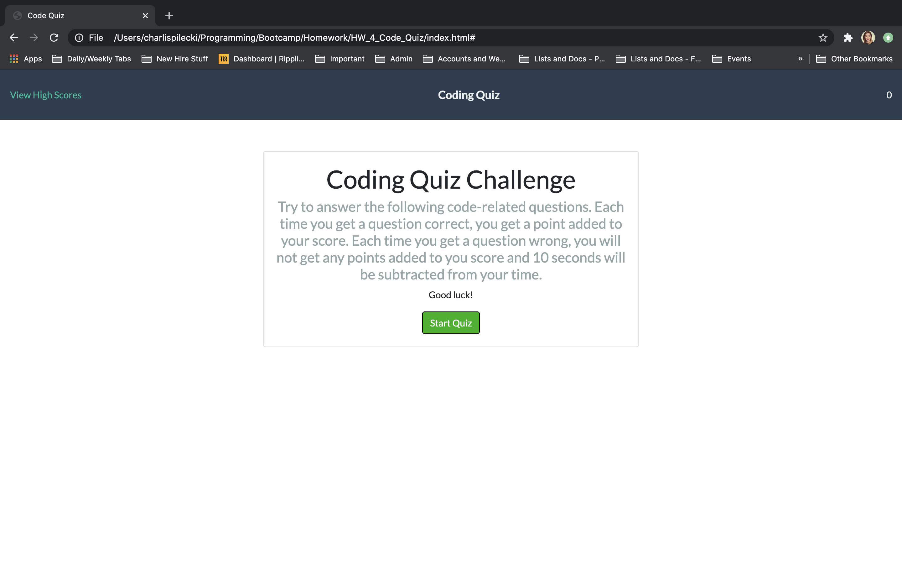
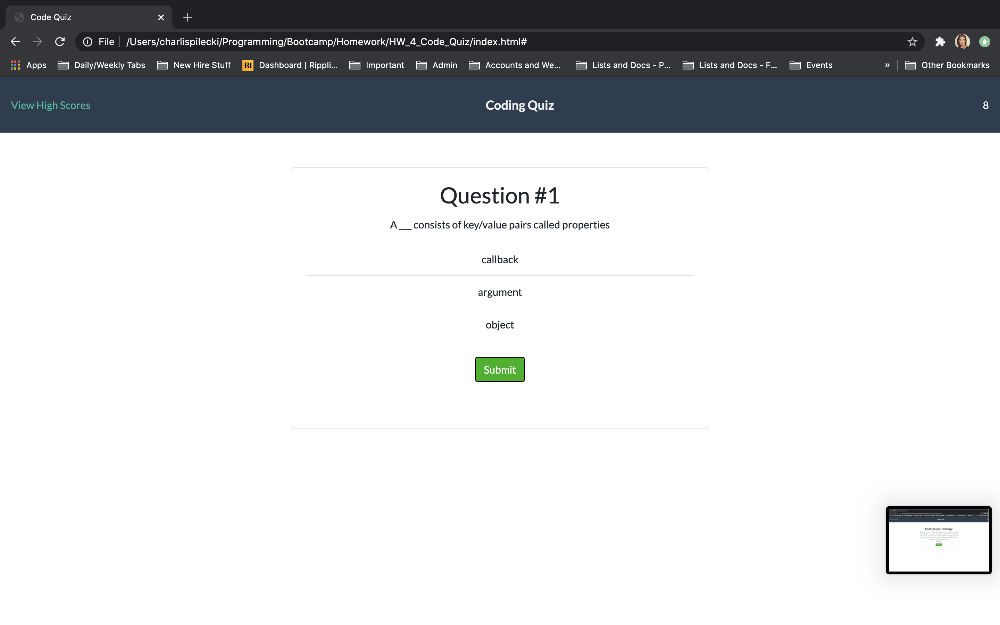
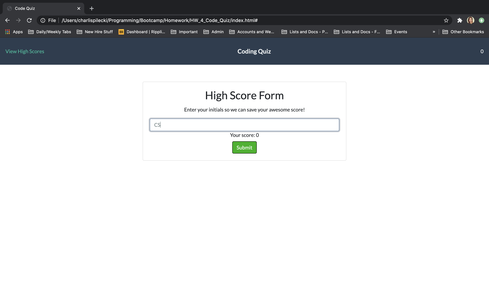
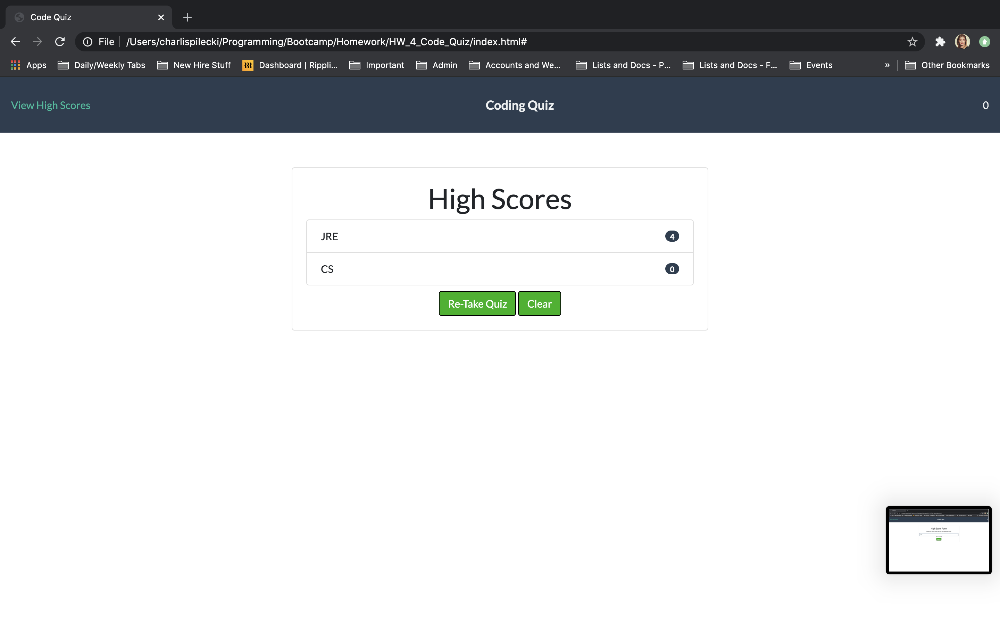

# HW_4_Code_Quiz

## About This Assignment
For this project, I worked with the languages of HTML, CSS, and Javascript; I also utilized Bootstrap, JSON, and local storage. I created a coding quiz that allows the user to run through multiple questions, receive a message if they get the answer wrong or right, and save their high score at the end of the game. The user can also clear all of the high scores and re-take the quiz. 

The game itself works by adding points to the user's score with every correct question. Wrong answers result in a deduction of time from the timer. 

## Screenshots

## Links

